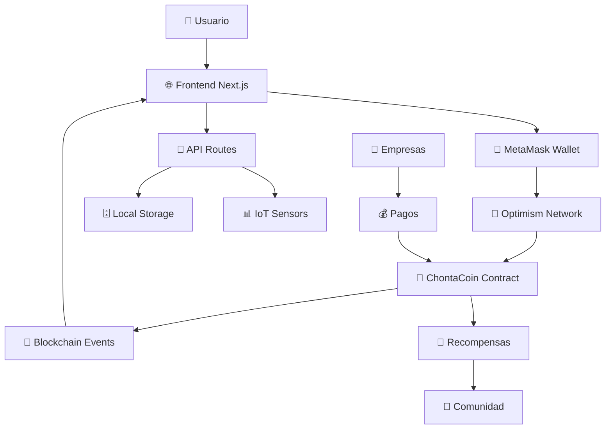

# 🌱 ChontaCoin - Documentación Técnica Completa

## Innovación Ciudadana y Sostenibilidad Ambiental en Cali

---

## 📋 Tabla de Contenidos

1. [Resumen Ejecutivo](#resumen-ejecutivo)
2. [Información del Contrato](#información-del-contrato)
3. [Arquitectura Técnica](#arquitectura-técnica)
4. [Frontend - Aplicación Web](#frontend---aplicación-web)
5. [Integración Blockchain](#integración-blockchain)
6. [Funcionalidades del Sistema](#funcionalidades-del-sistema)
7. [Instalación y Configuración](#instalación-y-configuración)
8. [Guía de Uso](#guía-de-uso)
9. [API y Contratos Inteligentes](#api-y-contratos-inteligentes)
10. [Despliegue y Producción](#despliegue-y-producción)
11. [Seguridad y Auditoría](#seguridad-y-auditoría)
12. [Roadmap Técnico](#roadmap-técnico)

---

## 🎯 Resumen Ejecutivo

**ChontaCoin** es una plataforma Web3 innovadora que utiliza tecnología blockchain para incentivar la participación ciudadana en actividades ambientales en Cali, Colombia. A través de un token ERC-20 (CHONTA), NFTs de participación (POAPs) y una interfaz web moderna, conectamos empresas, ciudadanos y el medio ambiente en un ecosistema económico circular sostenible.

### Problemática Abordada
- **Empresas**: Obligaciones legales costosas de compensación ambiental
- **Medio Ambiente**: Contaminación del Río Cali y falta de monitoreo
- **Comunidad**: Baja participación ciudadana en actividades ambientales

### Solución Propuesta
Plataforma que permite a empresas cumplir obligaciones ambientales financiando actividades ciudadanas que generan impacto medible, mientras los participantes reciben recompensas en ChontaCoins.

---

## 🏗️ Información del Contrato

### Contrato Principal: ChontaCoin (CHONTA)

```solidity
// SPDX-License-Identifier: MIT
pragma solidity ^0.8.27;

contract ChontaCoin is ERC20, ERC20Burnable, ERC20Pausable, Ownable, ERC20Permit
```

#### Especificaciones Técnicas

| Parámetro | Valor |
|-----------|-------|
| **Nombre** | ChontaCoin |
| **Símbolo** | CHONTA |
| **Estándar** | ERC-20 |
| **Red** | Optimism Mainnet |
| **Chain ID** | 10 |
| **Dirección del Contrato** | `0x066d677122699dd6340c11bded49d0352c51d2e2` |
| **Suministro Total** | 10,000,000 CHONTA |
| **Decimales** | 18 |
| **Dirección del Owner** | `0x0300db3dfc3ee04d628c3eb1ab69aefff53bb1e0` |

#### Funcionalidades del Contrato

**✅ Funciones Básicas ERC-20:**
- `transfer()` - Transferir tokens entre usuarios
- `approve()` - Aprobar gastos de tokens
- `balanceOf()` - Consultar balance de usuario
- `totalSupply()` - Consultar suministro total

**✅ Funciones Avanzadas:**
- `mint()` - Crear nuevos tokens (solo owner)
- `burn()` - Quemar tokens propios
- `pause()/unpause()` - Pausar/reanudar transferencias (solo owner)
- `permit()` - Aprobaciones con firmas off-chain

#### Verificación del Contrato

```bash
# Optimistic Etherscan
https://optimistic.etherscan.io/address/0x066d677122699dd6340c11bded49d0352c51d2e2

# Verificar información básica
curl -X GET "https://api-optimistic.etherscan.io/api?module=contract&action=getabi&address=0x066d677122699dd6340c11bded49d0352c51d2e2"
```

---

## 🏗️ Arquitectura Técnica

### Stack Tecnológico

#### Frontend
```json
{
  "framework": "Next.js 15.3.3",
  "react_version": "19.0.0",
  "styling": "TailwindCSS 4.0",
  "ui_components": "Radix UI",
  "icons": "Lucide React + React Icons",
  "animations": "tw-animate-css"
}
```

#### Blockchain & Web3
```json
{
  "web3_library": "ethers.js 6.14.3",
  "wallet_connection": "wagmi 2.15.6",
  "alternative_client": "viem 2.30.6",
  "state_management": "zustand 5.0.5",
  "queries": "@tanstack/react-query 5.80.6"
}
```

#### Utilidades
```json
{
  "qr_generation": "qrcode 1.5.4 + qr-code-styling 1.9.2",
  "date_handling": "date-fns 4.1.0",
  "encryption": "crypto-js 4.2.0",
  "hashing": "js-sha3 0.9.3",
  "styling_utils": "clsx 2.1.1 + tailwind-merge 3.3.0"
}
```

### Diagrama de Arquitectura



---

## 🌐 Frontend - Aplicación Web

### Estructura del Proyecto

```
chonta/
├── 📁 app/                     # Next.js App Router
│   ├── 📄 layout.tsx          # Layout principal
│   ├── 📄 page.tsx            # Landing page
│   ├── 📁 dashboard/          # Panel de usuario
│   ├── 📁 activities/         # Actividades disponibles
│   ├── 📁 wallet/             # Gestión de wallet
│   └── 📁 api/                # API routes
├── 📁 components/              # Componentes React
│   ├── 📁 ui/                 # Componentes base (Radix)
│   ├── 📁 layout/             # Header, Footer, etc.
│   ├── 📁 wallet/             # Conexión wallet
│   └── 📁 activities/         # Componentes de actividades
├── 📁 lib/                    # Utilidades y configuración
│   ├── 📄 contract.ts         # Configuración del contrato
│   ├── 📄 wagmi.ts           # Configuración Web3
│   └── 📄 utils.ts           # Utilidades generales
├── 📁 hooks/                  # Custom React hooks
├── 📁 stores/                 # Zustand stores
└── 📁 types/                  # TypeScript types
```

### Componentes Principales

#### 1. Landing Page
```typescript
// app/page.tsx
import { HeroSection } from '@/components/layout/HeroSection'
import { FeaturesSection } from '@/components/layout/FeaturesSection'
import { StatsSection } from '@/components/layout/StatsSection'
import { CTASection } from '@/components/layout/CTASection'

export default function LandingPage() {
  return (
    <main className="min-h-screen">
      <HeroSection />
      <FeaturesSection />
      <StatsSection />
      <CTASection />
    </main>
  )
}
```

#### 2. Conexión de Wallet
```typescript
// components/wallet/WalletConnect.tsx
'use client'

import { useConnect, useAccount, useDisconnect } from 'wagmi'
import { metaMask } from 'wagmi/connectors'
import { Button } from '@/components/ui/button'

export function WalletConnect() {
  const { connect } = useConnect()
  const { address, isConnected } = useAccount()
  const { disconnect } = useDisconnect()

  const handleConnect = () => {
    connect({ connector: metaMask() })
  }

  if (isConnected) {
    return (
      <div className="flex items-center gap-4">
        <span className="text-sm">
          {address?.slice(0, 6)}...{address?.slice(-4)}
        </span>
        <Button onClick={() => disconnect()} variant="outline">
          Desconectar
        </Button>
      </div>
    )
  }

  return (
    <Button onClick={handleConnect} className="bg-emerald-600">
      Conectar MetaMask
    </Button>
  )
}
```

#### 3. Dashboard de Usuario
```typescript
// app/dashboard/page.tsx
'use client'

import { useAccount } from 'wagmi'
import { useChontaBalance } from '@/hooks/useChontaBalance'
import { UserStats } from '@/components/dashboard/UserStats'
import { RecentActivities } from '@/components/dashboard/RecentActivities'
import { TokenBalance } from '@/components/dashboard/TokenBalance'

export default function Dashboard() {
  const { address } = useAccount()
  const { balance, isLoading } = useChontaBalance(address)

  return (
    <div className="container mx-auto p-6">
      <h1 className="text-3xl font-bold mb-8">Mi Dashboard</h1>
      
      <div className="grid grid-cols-1 md:grid-cols-3 gap-6 mb-8">
        <TokenBalance balance={balance} loading={isLoading} />
        <UserStats address={address} />
        <div className="bg-white p-6 rounded-lg shadow">
          <h3 className="text-lg font-semibold mb-4">Próximas Actividades</h3>
          {/* Lista de actividades */}
        </div>
      </div>
      
      <RecentActivities address={address} />
    </div>
  )
}
```

### Configuración de Estilos

#### TailwindCSS Configuration
```javascript
// tailwind.config.js
module.exports = {
  content: [
    './pages/**/*.{js,ts,jsx,tsx,mdx}',
    './components/**/*.{js,ts,jsx,tsx,mdx}',
    './app/**/*.{js,ts,jsx,tsx,mdx}',
  ],
  theme: {
    extend: {
      colors: {
        emerald: {
          50: '#ecfdf5',
          500: '#10b981',
          600: '#059669',
          700: '#047857',
        },
        chonta: {
          primary: '#10b981',
          secondary: '#34d399',
          accent: '#6ee7b7',
        }
      },
      fontFamily: {
        sans: ['Inter', 'system-ui', 'sans-serif'],
      },
    },
  },
  plugins: [],
}
```

---

## 🔗 Integración Blockchain

### Configuración Web3

#### Wagmi Configuration
```typescript
// lib/wagmi.ts
import { createConfig, http } from 'wagmi'
import { optimism } from 'wagmi/chains'
import { metaMask } from 'wagmi/connectors'

export const config = createConfig({
  chains: [optimism],
  connectors: [
    metaMask({
      dappMetadata: {
        name: 'ChontaCoin',
        description: 'Plataforma de sostenibilidad ambiental',
        url: 'https://chontacoin.vercel.app',
        iconUrl: 'https://chontacoin.vercel.app/icon.png',
      }
    })
  ],
  transports: {
    [optimism.id]: http('https://mainnet.optimism.io')
  },
})
```

#### Configuración del Contrato
```typescript
// lib/contract.ts
import { Address } from 'viem'

export const CHONTA_TOKEN_CONFIG = {
  address: '0x066d677122699dd6340c11bded49d0352c51d2e2' as Address,
  abi: [
    // Transfer function
    {
      inputs: [
        { name: 'to', type: 'address' },
        { name: 'amount', type: 'uint256' }
      ],
      name: 'transfer',
      outputs: [{ name: '', type: 'bool' }],
      stateMutability: 'nonpayable',
      type: 'function'
    },
    // Balance function
    {
      inputs: [{ name: 'account', type: 'address' }],
      name: 'balanceOf',
      outputs: [{ name: '', type: 'uint256' }],
      stateMutability: 'view',
      type: 'function'
    },
    // Mint function (only owner)
    {
      inputs: [
        { name: 'to', type: 'address' },
        { name: 'amount', type: 'uint256' }
      ],
      name: 'mint',
      outputs: [],
      stateMutability: 'nonpayable',
      type: 'function'
    },
    // Burn function
    {
      inputs: [{ name: 'amount', type: 'uint256' }],
      name: 'burn',
      outputs: [],
      stateMutability: 'nonpayable',
      type: 'function'
    },
    // Events
    {
      anonymous: false,
      inputs: [
        { indexed: true, name: 'from', type: 'address' },
        { indexed: true, name: 'to', type: 'address' },
        { indexed: false, name: 'value', type: 'uint256' }
      ],
      name: 'Transfer',
      type: 'event'
    }
  ] as const
} as const

export const OPTIMISM = {
  id: 10,
  name: 'Optimism',
  network: 'optimism',
  nativeCurrency: { name: 'Ether', symbol: 'ETH', decimals: 18 },
  rpcUrls: {
    default: { http: ['https://mainnet.optimism.io'] },
    public: { http: ['https://mainnet.optimism.io'] }
  },
  blockExplorers: {
    default: { 
      name: 'Optimistic Etherscan', 
      url: 'https://optimistic.etherscan.io' 
    }
  }
}
```

### Custom Hooks

#### Hook para Balance de CHONTA
```typescript
// hooks/useChontaBalance.ts
import { useReadContract } from 'wagmi'
import { formatEther } from 'viem'
import { CHONTA_TOKEN_CONFIG } from '@/lib/contract'

export function useChontaBalance(address?: string) {
  const { data, isLoading, error } = useReadContract({
    ...CHONTA_TOKEN_CONFIG,
    functionName: 'balanceOf',
    args: address ? [address as `0x${string}`] : undefined,
    query: {
      enabled: !!address,
      refetchInterval: 10000, // Refetch every 10 seconds
    }
  })

  const balance = data ? formatEther(data) : '0'

  return {
    balance,
    balanceRaw: data,
    isLoading,
    error,
    formattedBalance: `${parseFloat(balance).toLocaleString()} CHONTA`
  }
}
```

#### Hook para Transacciones
```typescript
// hooks/useChontaTransactions.ts
import { useWriteContract, useWaitForTransactionReceipt } from 'wagmi'
import { parseEther } from 'viem'
import { CHONTA_TOKEN_CONFIG } from '@/lib/contract'

export function useChontaTransfer() {
  const { writeContract, data: hash, isPending } = useWriteContract()
  
  const { isLoading: isConfirming, isSuccess } = useWaitForTransactionReceipt({
    hash,
  })

  const transfer = async (to: string, amount: string) => {
    try {
      writeContract({
        ...CHONTA_TOKEN_CONFIG,
        functionName: 'transfer',
        args: [to as `0x${string}`, parseEther(amount)]
      })
    } catch (error) {
      console.error('Transfer failed:', error)
      throw error
    }
  }

  return {
    transfer,
    hash,
    isPending,
    isConfirming,
    isSuccess
  }
}
```

---

## ⚙️ Funcionalidades del Sistema

### 1. Sistema de Recompensas

#### Recompensar Participación
```typescript
// components/activities/RewardUser.tsx
'use client'

import { useState } from 'react'
import { useWriteContract } from 'wagmi'
import { parseEther } from 'viem'
import { CHONTA_TOKEN_CONFIG } from '@/lib/contract'
import { Button } from '@/components/ui/button'
import { Input } from '@/components/ui/input'

interface RewardUserProps {
  participantAddress: string
  activityId: string
  suggestedReward: string
}

export function RewardUser({ participantAddress, activityId, suggestedReward }: RewardUserProps) {
  const [amount, setAmount] = useState(suggestedReward)
  const { writeContract, isPending } = useWriteContract()

  const handleReward = async () => {
    try {
      writeContract({
        ...CHONTA_TOKEN_CONFIG,
        functionName: 'mint',
        args: [participantAddress as `0x${string}`, parseEther(amount)]
      })
    } catch (error) {
      console.error('Reward failed:', error)
    }
  }

  return (
    <div className="p-4 border rounded-lg">
      <h3 className="font-semibold mb-2">Recompensar Participación</h3>
      <p className="text-sm text-gray-600 mb-4">
        Participante: {participantAddress.slice(0, 6)}...{participantAddress.slice(-4)}
      </p>
      
      <div className="flex gap-2">
        <Input
          type="number"
          value={amount}
          onChange={(e) => setAmount(e.target.value)}
          placeholder="Cantidad de CHONTA"
        />
        <Button 
          onClick={handleReward}
          disabled={isPending}
          className="bg-emerald-600"
        >
          {isPending ? 'Enviando...' : 'Recompensar'}
        </Button>
      </div>
    </div>
  )
}
```

### 2. Marketplace de Recompensas

#### Canje de Tokens
```typescript
// components/marketplace/RewardMarketplace.tsx
'use client'

import { 